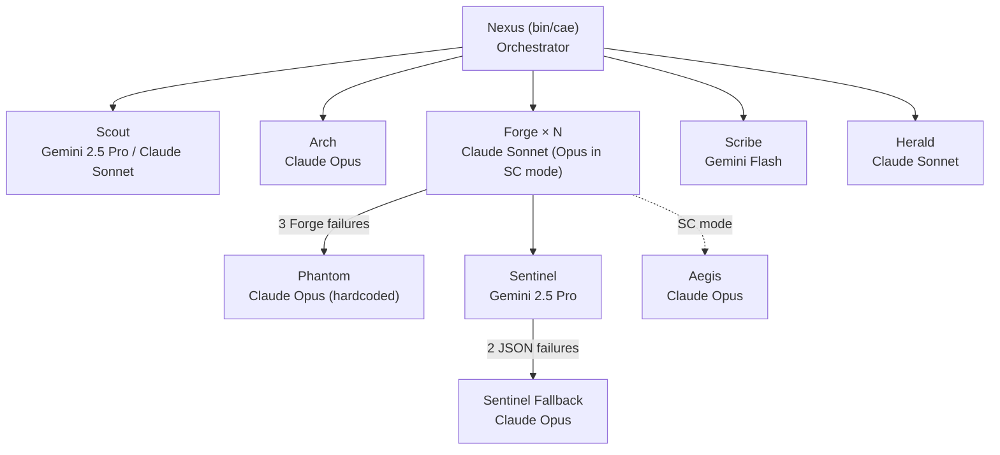

<task>
Fact-check this document against the actual codebase at `/home/cae/ctrl-alt-elite`.
Look for:
  • Hallucinated file paths, function names, config keys, version numbers
  • Aspirational claims stated as present-tense fact
  • Internal contradictions
  • Missing honest-status markers for planned-not-built features
Produce a JSON verdict with this exact shape:
{
  "verdict": "pass" | "fail",
  "issues": [
    {"severity": "CRITICAL|MAJOR|MINOR", "claim": "...", "problem": "...", "fix": "..."}
  ]
}
</task>

<doc_to_review>
<!-- generated-by: gsd-doc-writer -->
# CAE Architecture

## 1. Overview

Ctrl+Alt+Elite (CAE) is not a monolithic application — it is a composition layer that
wires four upstream harnesses (Claude Code, Gemini CLI, GSD, tmux) into a file-mediated
multi-agent development team. The single Python entry point (`bin/cae`, 972 lines,
`VERSION = "0.2.0-T7"`) reads declarative config, parses PLAN.md files into task waves,
and drives parallel agent invocations through tmux-wrapped subprocesses.

All persistent state lives on disk: task specifications in `.planning/phases/`, team
knowledge in `AGENTS.md`, execution events in `.cae/metrics/`. Agents are stateless
subprocesses invoked fresh per task — no long-lived sessions. Any agent can be swapped,
restarted, or replaced without affecting the others.

---

## 2. Component Map



**Agent roster and backing files (`config/agent-models.yaml`):**

| Agent | Model | Provider | Invocation |
|-------|-------|----------|------------|
| Nexus | claude-opus-4-6 | claude-code | `bin/cae` orchestrator (config entry `agents/cae-nexus.md` used for direct-prompt mode) |
| Scout | gemini-2.5-pro (project) / claude-sonnet-4-6 (phase) | gemini-cli / claude-code | `agents/cae-scout.md` (project-mode; `cae-scout-gemini.md` planned, not yet created) / `gsd-phase-researcher` wrap |
| Arch | claude-opus-4-6 | claude-code | `gsd-planner` wrap |
| Forge | claude-sonnet-4-6 (claude-opus-4-6 in SC mode) | claude-code | `agents/cae-forge.md` |
| Sentinel | gemini-2.5-pro → claude-opus-4-6 fallback | gemini-cli → claude-code | `agents/cae-sentinel-gemini.md` → `gsd-verifier` wrap |
| Scribe | gemini-flash | gemini-cli | `agents/cae-scribe-gemini.md` |
| Herald | claude-sonnet-4-6 | claude-code | `gsd-doc-writer` wrap |
| Phantom | claude-opus-4-6 (hardcoded in `bin/phantom.py:172`; `config/agent-models.yaml` declares `claude-sonnet-4-6` — config value is vestigial, runtime overrides it) | claude-code | `gsd-debugger` wrap |
| Aegis | claude-opus-4-6 | claude-code | `agents/cae-aegis.md` (SC mode only) |

---

## 3. Execution Flow

`cae execute-phase <N>` traces this path through `bin/cae`:

1. Load `config/agent-models.yaml` and `.planning/config.json`
2. Find phase dir: `.planning/phases/NN-*/` — glob with zero-padded phase number
3. Parse `*-PLAN.md` files: YAML frontmatter `wave:` field groups plans into ordered waves
4. **Per wave — parallel** up to `circuit_breakers.max_concurrent_forge` (4) via
   `threading.BoundedSemaphore`
5. **Per task:**
   - `cb.acquire_forge_slot()` — blocks until parallelism slot opens
   - `forge-branch.sh create <task_id>` — creates `forge/<task_id>` from HEAD
   - `Compactor.compact(task.md)` — 5-layer context cascade applied (§7)
   - `adapters/claude-code.sh <task.md> <model> <session_id> --system-prompt-file agents/cae-forge.md`
   - Output artifacts: `task.md.output`, `task.md.error`, `task.md.meta`
6. **Sentinel review** (`bin/sentinel.py`):
   - Primary: Gemini 2.5 Pro via `adapters/gemini-cli.sh` with `agents/cae-sentinel-gemini.md`
     (**Note:** `gemini-cli.sh` is structurally complete but UNTESTED pending T1 — Gemini CLI
     install + OAuth. All Gemini-backed paths (Sentinel primary, Scout project-mode, Scribe)
     fall back to Claude if `gemini` is unavailable on PATH.)
   - Validates `reviewer_model != builder_model`; rejects verdict if equal (line 141)
   - Fallback: Claude Opus via `gsd-verifier` after 2 cumulative JSON parse failures
7. **Approve** → `forge-branch.sh merge <task_id>` (`--no-ff`,
   commit message: "Merge forge/\<task_id\> (Sentinel-approved)") → branch deleted
8. **Reject** → Sentinel issues fed into `<retry_context>`; retry up to `max_retries` (3)
9. **3 Forge subprocess failures** → `bin/phantom.py` (`gsd-debugger`, Claude Opus):
   - Returns `PhantomResult.kind`: `"fix"` (instructions for next Forge), `"inline_done"`,
     or `"escalate"`
   - Context accumulated in `.planning/debug/<task_id>/` across re-invocations
10. **2 Phantom failures** → `CircuitBreakers.trigger_halt()` → execution stops;
    Telegram notification configured (`telegram_notify_on_halt: true`) but the TelegramGate
    call from the halt path is not yet wired in `bin/cae` (planned)
11. **Post-wave:** `bin/scribe.py` (Gemini Flash) extracts learnings → `AGENTS.md`

---

## 4. File-Mediated State

No live sessions. Everything that survives a process exit lives in files:

| Path | Written by | Purpose |
|------|-----------|---------|
| `.planning/phases/NN-*/PLAN.md` | Arch / GSD | Wave-ordered task definitions (YAML frontmatter) |
| `.planning/config.json` | `scripts/cae-init.sh` | Per-project model + skill overrides |
| `.planning/phases/<N>/tasks/<id>/task.md` | `bin/cae` | Per-task prompt; `.output` `.error` `.meta` sidecars written by adapters |
| `.planning/review/<task_id>/review-prompt.md` | `bin/sentinel.py` | Sentinel's per-task review prompt |
| `.planning/debug/<task_id>/` | `bin/phantom.py` | Rolling investigation context across re-invocations |
| `AGENTS.md` | `bin/scribe.py` | Shared team knowledge; 300-line hard cap; overflow → `KNOWLEDGE/<topic>.md` |
| `.cae/metrics/circuit-breakers.jsonl` | `bin/circuit_breakers.py` | Every limit trip, Forge/Phantom attempt |
| `.cae/metrics/sentinel.jsonl` | `bin/sentinel.py` | Verdict, model, JSON-parse failures |
| `.cae/metrics/compaction.jsonl` | `bin/compactor.py` | Layers fired, size reduction, fill% |
| `.cae/metrics/approvals.jsonl` | `bin/telegram_gate.py` | Gate triggers and approval decisions |
| `.cae/summaries/` | `bin/compactor.py` | Cached Haiku-generated file summaries (layer b) |

---

## 5. Configuration System

Three layers; highest wins:

```
config/agent-models.yaml     ← CAE repo (roles, models, providers, invocation modes)
        ↓ overridden by
.planning/config.json         ← per-project (model overrides, GSD skill injection)
        ↓ overridden by
PLAN.md task frontmatter      ← per-task (e.g., effort: low)
```

**`config/agent-models.yaml`** — role → `{model, provider, invocation_mode, fallback,
smart_contract_override}`. Read at every `cae execute-phase` run.

**`config/circuit-breakers.yaml`** — key limits include:

| Limit | Default | Scope |
|-------|---------|-------|
| `per_forge.max_turns` | 30 | Per Forge invocation |
| `per_forge.max_input_tokens` | 500,000 | Per task |
| `per_forge.max_output_tokens` | 100,000 | Per task |
| `per_task.max_retries` | 3 | Per task |
| `parallelism.max_concurrent_forge` | 4 | Per wave |
| `escalation.forge_failures_spawn_phantom` | 3 | Per task |
| `escalation.phantom_failures_halt` | 2 | Phase-wide |
| `sentinel.max_json_parse_failures` | 2 | Phase-wide |
| `gemini_cli.per_call_timeout_seconds` | 600 | Per Gemini call |
| `claude_code.per_call_timeout_seconds` | 1800 | Per Claude call |

**`config/dangerous-actions.yaml`** — 8 regex patterns matched case-insensitively:
on-chain broadcast, `git push main/master`, force push, GitHub repo edits,
`rm -rf`, deploy/release/publish, DROP TABLE/DATABASE/SCHEMA, `chmod 777`.

**`config/cae-schema.json`** — JSON Schema (draft 2020-12) for config validation.

**`.planning/config.json`** — generated by `scripts/cae-init.sh` from `agent-models.yaml`;
maps GSD agent types (`gsd_bridge` entries) to CAE skill dirs and model overrides.

---

## 6. Safety Layer

Three independent mechanisms:

### Circuit Breakers (`bin/circuit_breakers.py`, `class CircuitBreakers`)

- `threading.BoundedSemaphore(max_concurrent_forge)` gates task parallelism
- Per-task `TaskState` tracks turns, input/output tokens, retry counts, Phantom attempts
- `LimitExceeded` exception surfaces to the orchestrator's retry loop
- `BreakerConfig.from_yaml()` reads all limits from `config/circuit-breakers.yaml`
- All trips logged to `.cae/metrics/circuit-breakers.jsonl`

### Branch Isolation (`scripts/forge-branch.sh`)

- Every Forge task runs on its own `forge/<task_id>` branch created from HEAD
- Merge uses `--no-ff`; commit message: "Merge forge/\<task_id\> (Sentinel-approved)";
  branch deleted on success
- Failed tasks: `forge-branch.sh abandon` returns to prior branch; `forge/` branch
  retained for inspection
- Pre-push guard installed via `scripts/install-branch-guard.sh`;
  `CAE_MERGE_TOKEN` env var is the orchestrator's bypass signal

### Telegram Gate (`bin/telegram_gate.py`, `class TelegramGate`)

> **Status: implemented but not yet integrated.** `bin/telegram_gate.py` exists and is
> fully implemented, but `bin/cae` contains zero imports or calls to it. No
> dangerous-action checks run during execution. Integration is planned. The description
> below reflects the intended design, not current runtime behavior.

- Patterns from `config/dangerous-actions.yaml` matched via
  `re.compile(pattern, re.IGNORECASE)` against planned commands
- **Real mode** (`CAE_TELEGRAM_BOT_TOKEN` + `CAE_TELEGRAM_CHAT_ID` set): posts to
  Telegram; polls for `approve <token>` / `deny <token>` reply within pattern-defined
  timeout (5–30 minutes depending on action severity)
- **Stub mode** (no token): auto-approves with warning;
  `CAE_GATE_STUB_AUTO=0` flips to auto-deny (for tests)
- `ActionDenied` exception propagates to orchestrator → halt

---

## 7. Compaction Cascade

`bin/cae` invokes `claude --print` (one turn per subprocess). Context pressure accumulates
across retries as `<retry_context>` blocks in `task.md`. `bin/compactor.py`
(`class Compactor`) applies five layers cheapest-first before each Forge spawn:

| Layer | Trigger | Mechanism |
|-------|---------|-----------|
| (a) Tool output budgets | Always | Injects `<tool_budgets>`: Read ≤ 2000, Grep ≤ 1000, Bash ≤ 3000 output tokens |
| (b) File summaries | File > 500 lines | Haiku pre-summarizes; cached in `.cae/summaries/`; `<files_to_read>` refs replaced with summary path |
| (c) Turn pruning | > 15 retry_context blocks | Older blocks condensed to one-line stubs; last 15 kept verbatim |
| (d) Caveman activation | ≥ 60% context fill | Injects `<compression_mode>` instruction; targets 65–75% output token reduction |
| (e) Hard summarization | ≥ 85% context fill | All retry_context blocks except the most recent replaced with a Haiku-generated `<retry_history_summary>` |

Context window estimates in code: Claude ≈ 800,000 chars (200K tokens);
Gemini ≈ 4,000,000 chars (1M tokens). All firings logged to
`.cae/metrics/compaction.jsonl`.

---

## 8. Smart Contract Mode

Auto-activated when any of these markers appear within 3 directory levels
(`find . -maxdepth 3` in `scripts/cae-init.sh`) or anywhere in the tree
(`rglob` in `bin/cae`):

```
*.sol  *.vy  foundry.toml  hardhat.config.{js,ts,cjs}  truffle-config.js  remappings.txt
```

**What changes:**

- `forge.smart_contract_override: claude-opus-4-6` — Forge upgrades from Sonnet to Opus
- Aegis auto-activates after every Sentinel review on `.sol`/`.vy` changes
- Aegis persona: `agents/cae-aegis.md`, claude-opus-4-6, direct-prompt mode
- Smart contract supplement appended to `AGENTS.md` from `config/smart-contract-supplement.md`
- Sentinel model unchanged — Gemini 2.5 Pro reviews either way

Detection runs at `scripts/cae-init.sh` (project setup) and at every `cae execute-phase`
invocation (`detect_smart_contract_mode()` in `bin/cae`).

---

## 9. Directory Structure

**CAE repo:**

```
bin/
  cae                     # Orchestrator entry point (Python, 972 lines, v0.2.0-T7)
  sentinel.py             # Cross-provider adversarial reviewer
  phantom.py              # gsd-debugger integration + rolling context preparation
  compactor.py            # 5-layer context cascade
  circuit_breakers.py     # Hard limits, BoundedSemaphore, LimitExceeded
  telegram_gate.py        # Dangerous-action approval gate (implemented; not yet wired)
  scribe.py               # Post-wave knowledge extraction
adapters/
  claude-code.sh          # tmux subprocess: claude --print; exit codes 0/1/2/3
  gemini-cli.sh           # tmux subprocess: gemini; mirrors claude-code.sh; adds exit 4 (JSON invalid)
                          # UNTESTED pending T1 (Gemini CLI install + OAuth)
agents/                   # 13 persona system prompt files
  cae-nexus.md  cae-forge.md  cae-sentinel-gemini.md  cae-scribe-gemini.md
  cae-aegis.md  cae-arch.md   cae-scout.md  cae-herald.md  cae-phantom.md
  cae-prism.md  cae-flux.md   cae-scribe.md  cae-sentinel.md
config/
  agent-models.yaml       # Role → model/provider/invocation routing
  circuit-breakers.yaml   # Hard limits (per_forge, per_task, parallelism, escalation, sentinel, timeouts)
  dangerous-actions.yaml  # 8 Telegram-gate patterns
  cae-schema.json         # JSON Schema for config validation
  model-profiles.json     # Named model profile sets
  smart-contract-supplement.md
hooks/
  cae-multica-hook.js     # Multi-CA bridge hook
  cae-scribe-hook.js      # Post-wave Scribe trigger hook
skills/                   # Claude Code skill dirs injected by cae-init into projects
  cae-forge/  cae-arch/  cae-sentinel/  cae-scribe/  cae-scout/
  cae-herald/  cae-aegis/  cae-init/
scripts/
  install.sh              # One-command CAE install
  cae-init.sh             # Per-project setup: config.json generation, skill injection
  forge-branch.sh         # create / merge / abandon / cleanup for forge/* branches
  install-hooks.sh        # Git hook installation
  install-branch-guard.sh # Pre-push guard against non-CAE main pushes
  multica-bridge.sh       # Multi-CA bridge helper
  t14-acceptance.sh       # Acceptance test suite
docs/
  WRAPPED_AGENT_CONTRACTS.md  # Agent output contracts (section markers, JSON schema)
  WHEN_T1_LANDS.md
```

**Per-project at runtime (not in CAE repo):**

```
.planning/
  config.json             # Generated by cae-init.sh
  phases/NN-*/            # PLAN.md files + tasks/<id>/ output dirs
  review/<task_id>/       # Sentinel review prompts
  debug/<task_id>/        # Phantom investigation context
AGENTS.md                 # Team knowledge base (300-line cap)
KNOWLEDGE/                # Overflow topic files
.cae/metrics/             # *.jsonl event logs
.cae/summaries/           # Cached Haiku file summaries
```

---

## 10. Extension Points

**New agent role:** Add entry to `config/agent-models.yaml` (`model`, `provider`,
`invocation_mode`). Create persona markdown in `agents/`. Add a `gsd_bridge` entry if
wrapping a GSD agent type.

**New adapter (LLM runtime):** Mirror `adapters/claude-code.sh`'s interface —
accept `<task_file> <model> <session_id> [options]`; write `.output`, `.error`, `.meta`
sidecar files; exit codes `0` (success), `1` (error), `2` (timeout), `3` (bad args).

**New circuit breaker:** Add field to `BreakerConfig` in `bin/circuit_breakers.py` and
matching YAML key in `config/circuit-breakers.yaml`. Wire enforcement into the relevant
tracking method (`record_forge_turn`, `record_tokens`, etc.).

**New dangerous-action pattern:** Append `{name, regex, description, telegram_timeout_minutes}`
to `config/dangerous-actions.yaml`. No code changes needed.

**New specialist (auto-detect):** Add glob patterns to `auto_activate_on` in
`config/agent-models.yaml` (see `aegis` for example). Add matching detection logic in
`scripts/cae-init.sh` and `detect_smart_contract_mode()` in `bin/cae`.

</doc_to_review>

<instructions>
Use Read/Grep/Glob to verify. Be strict — prefer flagging false positives over
missing real hallucinations. Return ONLY the JSON verdict at the end. "pass" means
zero CRITICAL or MAJOR issues.
</instructions>
