<p align="center">
  
</p>

```
 ┏━━━━━━━━━━━━━━━┓  ┏━━━━━━━━━━━━━━━┓  ┏━━━━━━━━━━━━━━━━━━━━━┓
 ┃╭─────────────╮┃  ┃╭─────────────╮┃  ┃╭───────────────────╮┃
 ┃│             │┃  ┃│             │┃  ┃│                   │┃
 ┃│    CTRL     │┃+ ┃│     ALT     │┃+ ┃│       ELITE       │┃
 ┃│             │┃  ┃│             │┃  ┃│                   │┃
 ┃╰─────────────╯┃  ┃╰─────────────╯┃  ┃╰───────────────────╯┃
 ┗━━━━━━━━━━━━━━━┛  ┗━━━━━━━━━━━━━━━┛  ┗━━━━━━━━━━━━━━━━━━━━━┛
╱                 ╲╱                 ╲╱                       ╲
━━━━━━━━━━━━━━━━━━━━━━━━━━━━━━━━━━━━━━━━━━━━━━━━━━━━━━━━━━━━━━━━━
                              │
                              ▼
             ╔═════════════════════════════════╗
             ║  [OK]  nexus      spawned       ║
             ║  [OK]  forge × 3  standby       ║
             ║  [OK]  sentinel   ≠ builder  ✓  ║
             ║  [OK]  scribe     learning      ║
             ║  ─────────────────────────────  ║
             ║  ▸ dev team ready · ship it     ║
             ╚═════════════════════════════════╝
```

> **The AI coder that gets code-reviewed.**

<p align="center">
  <a href="./PHASE_1_TASKS.md"></a>
  <a href="./LICENSE"></a>
  
  
</p>

---

## The problem

One-shot AI coders — Cursor, Aider, Devin, Claude Code solo — all have the same blind spot: **when one model builds AND verifies, it rubber-stamps its own work.** Ask Claude to write a function then ask Claude to review it, and you get a diff-party with no reviewer. Real bugs slip through. Architecture drifts. No one pushes back.

Human dev shops solve this with teams: someone builds, someone else reviews, someone debugs, someone documents. That's the pattern.

## What CAE is

**Ctrl+Alt+Elite is an AI dev shop.** A team of specialized AI agents orchestrated through file-mediated handoffs — no long-lived sessions, no context rot, no rubber-stamping.

You hand CAE a buildplan. **Forge** implements. **Sentinel** (a *different* model) reviews adversarially. **Scribe** extracts learnings into a shared `AGENTS.md` that the next task reads. **Phantom** debugs when Forge fails three times. **Aegis** audits security when it sees Solidity. Every agent runs in a fresh context, spawned per task, killed when done.

Built on top of [GSD (Get-Shit-Done)](https://github.com/gsd-build/get-shit-done) and [Claude Code](https://docs.anthropic.com/en/docs/claude-code), with [Gemini CLI](https://github.com/google-gemini/gemini-cli) for cross-provider adversarial review.

## 30-second quick start

```bash
git clone https://github.com/notsatoshii/CAE.git
cd CAE && ./scripts/install.sh

# In any project directory
cd your-project
gsd-new-project        # one-time intake
cae execute-phase 1    # ship it
```

Requires: Claude Code CLI (authenticated), Python 3.9+, Bash, tmux, git. Gemini CLI optional (real Sentinel upgrades to cross-provider if available; falls back to Claude Opus `gsd-verifier` otherwise).

## What makes it different

- **Reviewer ≠ Builder, enforced at the code level.** Sentinel runs on a different model than Forge. Verdicts where `reviewer_model == builder_model` are rejected and re-run on the fallback. No self-review loopholes.
- **File-mediated, not session-based.** Every agent spawns fresh, reads shared state from disk (`PLAN.md`, `AGENTS.md`, `SUMMARY.md`, `KNOWLEDGE/`), writes, then dies. No context rot between tasks. No surprise conversation pruning on turn 20.
- **GSD methodology inherited, not rebuilt.** 3,150 lines of battle-tested prompt engineering wrap cleanly as agents (`claude --print --agent gsd-*`). CAE doesn't reinvent what works.
- **Production guardrails baked in.** Branch isolation (`forge/<task-id>` with pre-push hook), circuit breakers (turn budget, retry cap, token limit, concurrent Forge semaphore), Telegram approval gate for dangerous actions (`rm -rf`, `git push main`, on-chain broadcasts).
- **Smart-contract aware.** Auto-detects `.sol`/`.vy`/`foundry.toml`, promotes Forge to Opus, runs Aegis (security auditor) after every contract change.
- **Persistent learning.** Scribe (Gemini Flash, falls back to Haiku) extracts learnings after each phase. 300-line `AGENTS.md` hard cap; overflow rotates to `KNOWLEDGE/*.md` topic files. Tasks tagged `tags: [solidity, auth]` pull in the matching knowledge.

## How it works

```
                    ┌────────────────────────┐
                    │  NEXUS (orchestrator)  │
                    │  reads PLAN.md         │
                    └───┬────────────────────┘
                        │ dispatch (wave-parallel)
        ┌───────────────┼───────────────┐
        ▼               ▼               ▼
   ┌─────────┐     ┌─────────┐     ┌─────────┐
   │ FORGE 1 │     │ FORGE 2 │     │ FORGE 3 │   each on forge/<task-id>
   │ Sonnet  │     │ Sonnet  │     │ Sonnet  │   branch, fresh context
   └────┬────┘     └────┬────┘     └────┬────┘
        │               │               │
        └───────────────┼───────────────┘
                        │ diffs
                        ▼
                ┌───────────────────┐
                │ SENTINEL          │   ◄─ different model than Forge
                │ Gemini 2.5 Pro    │      (Opus gsd-verifier fallback)
                │ goal-backward     │
                │ 3-level review    │
                └─────┬─────────┬───┘
                      │ approve │ reject
                      ▼         ▼
                 merge to    retry (with issues)
                 phase branch  → 3 fails → PHANTOM (debugger)
                      │                    → 2 fails → HALT + Telegram
                      ▼
                ┌──────────────┐
                │ SCRIBE       │   ◄─ extracts learnings
                │ Gemini Flash │      updates AGENTS.md + KNOWLEDGE/
                └──────────────┘
```

Every arrow is a file on disk. Every agent is `claude --print` or `gemini -p` in a tmux pane. No sessions. No daemons. Fully introspectable — `tail -f .cae/metrics/*.jsonl` shows every decision in real time.

## Agent roster

### Core team (every project)
| Agent    | Role                                      | Default model       | Invocation           |
|----------|-------------------------------------------|---------------------|----------------------|
| Nexus    | Orchestrator — reads plan, dispatches     | Claude Opus         | direct-prompt        |
| Arch     | Architect — authors plans, checks them    | Claude Opus         | wrap `gsd-planner`   |
| Forge    | Builder — implements one task             | Claude Sonnet       | direct-prompt        |
| Sentinel | Reviewer — enforced ≠ builder model       | Gemini 2.5 Pro      | direct-prompt        |
| Scout    | Researcher — codebase + domain briefs     | Gemini 2.5 Pro      | direct-prompt        |
| Scribe   | Knowledge keeper — AGENTS.md learnings    | Gemini Flash        | direct-prompt        |

### Specialists (auto-activated or on-demand)
| Agent    | When                                       | Default model       |
|----------|--------------------------------------------|---------------------|
| Aegis    | Smart contracts detected                   | Claude Opus         |
| Phantom  | 3 Forge failures on same task              | Claude Sonnet       |
| Prism    | UI-heavy phases                            | Claude Sonnet       |
| Flux     | DevOps / infrastructure tasks              | Claude Sonnet       |
| Herald   | Project-level docs (README, ARCHITECTURE)  | Claude Sonnet       |

Sentinel falls back to `gsd-verifier` wrap on Claude Opus if Gemini isn't available — adversarial diversity preserved (Opus reviews Sonnet builder).

## CAE vs other AI coding tools

| Capability                               | Claude Code solo | Aider    | Cursor   | Devin    | **CAE**       |
|------------------------------------------|------------------|----------|----------|----------|---------------|
| Multi-agent team                         | ✗                | ✗        | ✗        | ~        | ✅            |
| Reviewer ≠ builder model, enforced       | ✗                | ✗        | ✗        | ✗        | ✅            |
| File-mediated handoffs (no context rot)  | ✗                | ✗        | ✗        | ✗        | ✅            |
| GSD phase/wave workflow                  | ✗                | ✗        | ✗        | ✗        | ✅            |
| Production circuit breakers              | ✗                | ✗        | ✗        | ~        | ✅            |
| Smart-contract mode                      | ✗                | ✗        | ✗        | ✗        | ✅            |
| Telegram approval for dangerous ops      | ✗                | ✗        | ✗        | ✗        | ✅            |
| Persistent learning across sessions      | ~                | ~        | ~        | ~        | ✅ AGENTS.md  |
| Fresh context per task                   | ✗                | ✗        | ✗        | ✗        | ✅            |
| IDE integration                          | CLI              | CLI      | ✅       | web      | CLI           |
| Runs on own API key (no vendor lock)     | ✅               | ✅       | ✗        | ✗        | ✅            |

`~` = partial / unclear / mode-dependent.

## Who this is for

- **Founders shipping real products** who can't afford one-shot AI's silent confabulation.
- **Smart-contract teams** where mistakes cost $10K+ — Aegis auditor + Opus on contract code + Gemini adversarial review.
- **Long-horizon projects** where context rot kills quality by week 3. File-mediated handoffs don't rot.
- **People building with AI on nights/weekends** who need a team to catch their mistakes while they sleep.

Not for: one-off scripts (use `claude` directly), pair-programming flow (use Cursor), or research prototypes where review is noise.

## Status

**Phase 1 complete** — orchestrator, safety layer, wrapped GSD agents, cross-provider Sentinel, automated Scribe, Phantom integration, Telegram gate, compaction cascade, full acceptance gate (23/0/4 passing on Claude-only; Gemini PART B live now). See [`PHASE_1_TASKS.md`](./PHASE_1_TASKS.md).

**Phase 2 in progress** — Herald (doc writer), Timmy bridge (external orchestration), Shift (normie-facing project genesis). See [`PHASE_2_PLAN.md`](./PHASE_2_PLAN.md).

**Roadmap** — multi-project orchestration, metrics UI, real job queue (upgrade from file-lock semaphore), Slack/email notifications, rollback automation.

Honest positioning: **early**. Phase 1 passed a toy workload (markdown-to-JSON converter, calc CLI). Not yet proven on production-scale projects. Star the repo if you want to follow; issues welcome if you try it.

## Requirements

- **Claude Code CLI** — authenticated (`claude --version`)
- **Python 3.9+** with PyYAML (`apt install python3-yaml`)
- **Bash 5+**, **tmux**, **git**
- **Gemini CLI** (optional) — `npm install -g @google/gemini-cli`, OAuth via `gemini` interactive (`GOOGLE_GENAI_USE_GCA` path → generous free tier). Without Gemini, Sentinel/Scribe fall back to Claude Opus/Haiku automatically.
- **Telegram bot** (optional) — required for dangerous-action approval. Without it, stub mode auto-approves with loud warnings.

## Install

```bash
git clone https://github.com/notsatoshii/CAE.git
cd CAE
./scripts/install.sh
```

The installer:
1. Puts `cae` on your PATH (symlink to `bin/cae`)
2. Installs the Claude Code hook for per-project `cae-init.sh` invocation
3. Installs the git `pre-push` branch guard template

Then in any project:
```bash
cd your-project
gsd-new-project               # intake — produces PROJECT.md + ROADMAP.md
bash /path/to/CAE/scripts/cae-init.sh .   # generate .planning/config.json for CAE
cae execute-phase 1           # dispatch phase 1 tasks
```

See [`docs/WRAPPED_AGENT_CONTRACTS.md`](./docs/WRAPPED_AGENT_CONTRACTS.md) for the contract each wrapped GSD agent expects.

## Configuration

CAE is entirely config-driven. Config surface (all stable — see [`CONFIG_SCHEMA.md`](./CONFIG_SCHEMA.md)):

- `config/agent-models.yaml` — role → {model, provider, invocation_mode}. Change Opus to Haiku globally in one line.
- `config/circuit-breakers.yaml` — 6 limits (turn budget, retry cap, concurrent Forge, tokens in/out, sentinel JSON failures).
- `config/dangerous-actions.yaml` — regex patterns that trigger Telegram gate.
- `config/cae-schema.json` — JSON Schema for programmatic validation (draft 2020-12).

Per-project overrides go into `.planning/config.json`. Per-task overrides via `task.md` frontmatter (e.g., `effort: low` to cheap out a trivial task).

## Project structure

```
CAE/
├── bin/           # cae orchestrator + sentinel + scribe + phantom + compactor
├── adapters/      # claude-code.sh, gemini-cli.sh (tmux-wrapped subprocess invokers)
├── agents/        # 10+ persona markdown files
├── skills/        # Claude Code skills injected into wrapped GSD agents
├── config/        # agent-models, circuit-breakers, dangerous-actions, schema
├── scripts/       # install, cae-init, forge-branch, install-hooks, t14-acceptance
├── assets/        # README banner (animated SVG)
└── docs/          # WRAPPED_AGENT_CONTRACTS, WHEN_T1_LANDS
```

## Built on, inspired by

- **[GSD (Get-Shit-Done)](https://github.com/gsd-build/get-shit-done)** — phase-based workflow, wave execution, worktree isolation, state persistence. 3,150 lines of prompt engineering CAE inherits cleanly.
- **[Claude Code](https://docs.anthropic.com/en/docs/claude-code)** — primary AI coding runtime.
- **[Gemini CLI](https://github.com/google-gemini/gemini-cli)** — Gemini Code Assist for adversarial review + cheap knowledge extraction.
- Pattern references: **[Ralph](https://github.com/snarktank/ralph)** (fresh context per task, AGENTS.md learning loop), **[Claude-Mem](https://github.com/thedotmack/claude-mem)** (3-layer context injection).

## Contributing

Early stage. Open an issue before a PR if the change is non-trivial — architecture is still solidifying (see Phase 2 plan). Bugs, new agent personas, adapter improvements for other AI CLIs all welcome.

## License

MIT. See [LICENSE](./LICENSE).

---

<p align="center">
  Built by <a href="https://github.com/notsatoshii">@notsatoshii</a> · Questions → <a href="https://github.com/notsatoshii/CAE/issues">issues</a> · If CAE saves you a 3am bug, star the repo.
</p>
